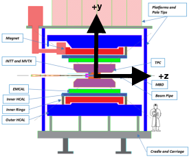

# sphenixoperamaps

This repository contains magnetic field maps calculated by Wuzheng Meng and Kin Yip for the sPHENIX magnet with OPERA.  These maps are intended to be used in the sPHENIX GEANT4 Monte Carlo simulation.

The right-handed coordinate system is show here below.  The positions are in centimeters, the field is in Gauss.  The symmetry is broken by the magnet's chimney.  

The center of the coil is offset from the center of the cryostat by about 28.5 mm as described here: [https://brookhavenlab.sharepoint.com/sites/sPHENIXMagnet/External/SitePages/Parameters.aspx] (formerly [https://collab.external.bnl.gov/sites/sPHENIX-Magnet/SitePages/Parameters.aspx]) and the default maps in the root files reflect that.  The phi component of the field is still quite small (< 2 G) and can probably be neglected.
